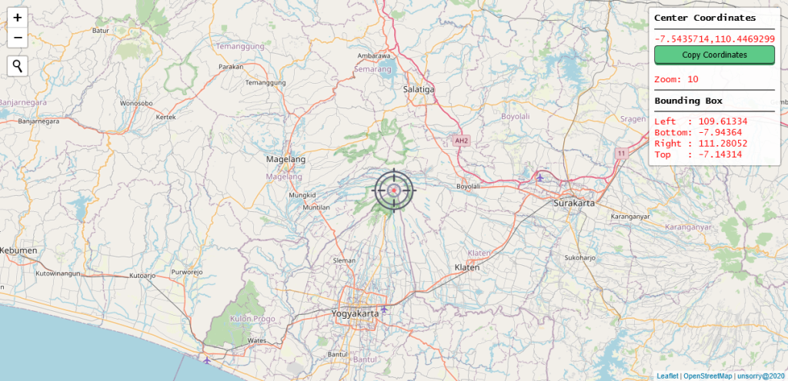

# leafletjs-mapcentercoordinate
Guide for determining the center point of the map and zoom value in creating a web map

---
 Demo: [https://www.unsorry.net/git/leafletjs-mapcentercoordinate](https://www.unsorry.net/git/leafletjs-mapcentercoordinate)
---

##### Leaflet plugins in used:
- [Map center coordinate](https://github.com/xguaita/Leaflet.MapCenterCoord)
- [Zoom Display](https://github.com/azavea/Leaflet.zoomdisplay)
- [OSM Geocoder](https://github.com/k4r573n/leaflet-control-osm-geocoder)